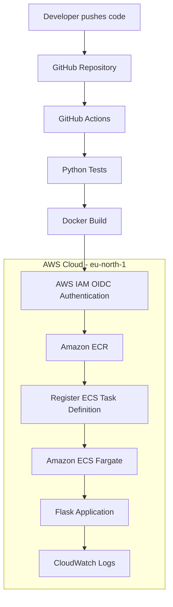

# AWS CI/CD Pipeline Architecture

This diagram illustrates the automated deployment workflow from GitHub to AWS ECS Fargate.

```mermaid
flowchart TD
    A["Developer pushes code"] --> B["GitHub Repository"]
    B --> C["GitHub Actions"]
    C --> D["Python Tests"]
    D --> E["Docker Build"]
    E --> F["AWS IAM OIDC Authentication"]
    F --> G["Amazon ECR"]
    G --> H["Register ECS Task Definition"]
    H --> I["Amazon ECS Fargate"]
    I --> J["Flask Application"]
    J --> K["CloudWatch Logs"]

    subgraph AWS["AWS Cloud - eu-north-1"]
        F
        G
        H
        I
        J
        K
    end
```
